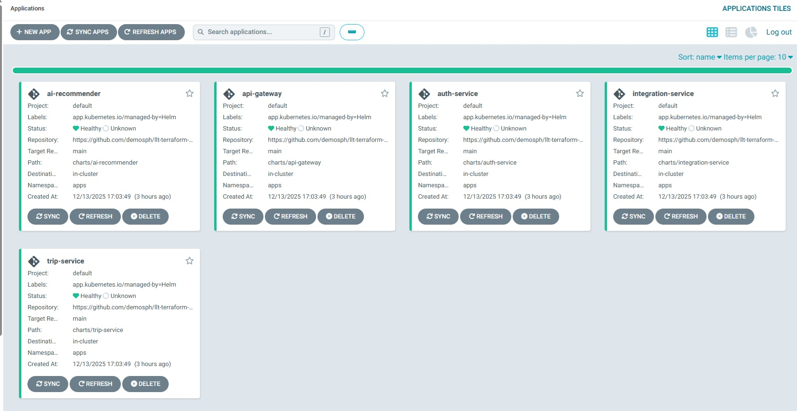
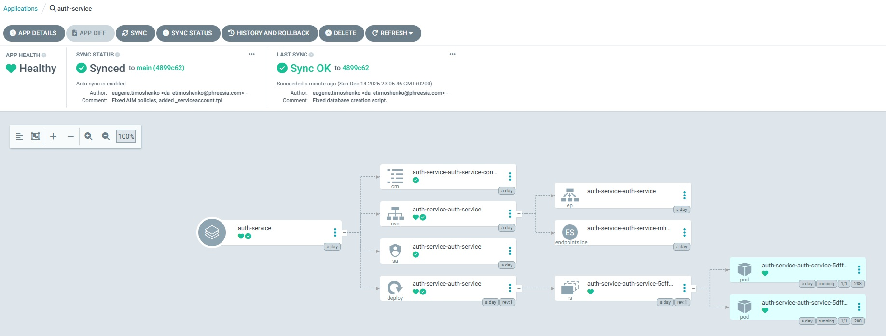

# Інфраструктурний проєкт для LittleLifeTrip застосунку на Terraform та Kubernetes (EKS)

- **S3** бакет і **DynamoDB** таблиця для remote backend стану Terraform.
- Базова **VPC** з публічними та приватними підмережами і маршрутизацією.
- **ECR** репозиторії з авто-скануванням образів та політиками доступу.
- **EKS** кластер з нод группою, IAM ролями та необхідними аддонами
- **Argo CD** GitOps інструмент для відстежування конфігурації в репозиторії та автоматичного оновлення додатку
- **Helm-чарти** мікросервісів застосунку

### Налаштування середовища і запуск розгортання інфраструктури

Інфраструктура розділена на два окремих Terraform-стеки:

- `infra-stack` — базова інфраструктура (мережа, безпека, S3, ECR, EKS).
- `apps-stack` — застосунки у кластері EKS (Helm-чарти, Argo-CD, PostgreSQL, K8S External Secrets).

**Передумови:**

- AWS CLI v2
- Облікові дані з правами на: S3, DynamoDB, VPC, Subnet, Internet Gateway, Route Table, ECR.

**Налаштування облікових даних**

Можна використати або змінні середовища PowerShell, або AWS CLI

**PowerShell:**

```
$env:AWS_ACCESS_KEY_ID     = <AWS_ACCESS_KEY>
$env:AWS_SECRET_ACCESS_KEY = <AWS_SECRET_KEY>

# (опційно) регіон
$env:AWS_REGION = "us-east-2"
```

#### Infra stack

**Bootstrapping бекенда (важливо)**

Якщо **S3 бакет** та **DynamoDB** таблиця для бекенда ще не існують:

1. Тимчасово закоментуйте блок `terraform` у `backend.tf` (або не підключайте файл).

2. Перейдіть в каталог `infra-stack`

3. Створіть ресурси локальним стейтом:

```
terraform init
terraform apply
```

4. Розкоментуйте блок `terraform` у `backend.tf` і мігруйте стейт:

```
terraform init -migrate-state
```

5. Далі працюйте як зазвичай (`plan/apply`) — тепер стейт зберігатиметься у S3 з блокуванням у DynamoDB.

Якщо бекенд уже існує — просто виконайте стандартні команди нижче.

#### App stack

1. Перейдіть в каталог `app-stack`

2. Створіть ресурси:

```
terraform init
terraform apply -var="github_user=<your_github_user>" -var="github_pat=<your_github_pat_key>"
```

#### Команди для запуску

1. Ініціалізація

```
terraform init
```

2. Перевірка плану змін

```
terraform plan
```

3. Застосування змін

```
terraform apply
```

Підтвердіть виконання, коли Terraform покаже план.

4. Знищення ресурсів

```
# Знищення всіх ресурсів
terraform destroy
```

### Опис модулів

#### s3-backend

- **Що створює:**

  - **S3** бакет для `terraform.tfstate` з версіонуванням та `BucketOwnerEnforced` ownership controls.
  - **DynamoDB** таблицю для блокування стейту.

- **Навіщо:** централізоване зберігання стейту і блокування для роботи в команді.
- **Ключові ресурси:** `aws_s3_bucket`, `aws_s3_bucket_versioning`, `aws_s3_bucket_ownership_controls`, `aws_dynamodb_table`.
- **Виводи:** `s3_bucket_name`, `dynamodb_table_name`.

#### vpc

- **Що створює:**

  - **VPC** з увімкненими DNS.
  - Набір **public** і **private** підмереж у вказаних **AZs**.
  - **Internet Gateway** для публічних підмереж.
  - **Route table** для виходу в інтернет + асоціації з public-subnets.

- **Навіщо:** базова мережева інфраструктура для розгортання ресурсів.
- **Ключові ресурси:** `aws_vpc`, `aws_subnet` (public/private), `aws_internet_gateway`, `aws_route_table`, `aws_route`, `aws_route_table_association`.
- **Виводи:** `vpc_id`, `public_subnets`, `private_subnets`, `internet_gateway_id`.

#### ecr

- **Що створює:**

  - **ECR repository** з `scan_on_push` та шифруванням (`AES256` або `KMS`).
  - **Repository policy**, яка дозволяє `push/pull` всередині вашого акаунту (Principal = `arn:aws:iam::<account_id>:root`).

- **Навіщо:** централізоване та кероване зберігання Docker/OCI-образів у межах AWS.
- **Ключові ресурси:** `aws_iam_policy_document`, `aws_ecr_repository`, `aws_ecr_repository_policy`.
- **Виводи:** `repository_url`, `repository_arn`, `repository_name`.

#### eks

- **Що створює:**

  - **IAM роль кластера** `(aws_iam_role.eks)` з trust-політикою для `eks.amazonaws.com` і прив’язкою політики `AmazonEKSClusterPolicy`.
  - **IAM роль вузлів** `(aws_iam_role.nodes)` з trust-політикою для `ec2.amazonaws.com` і прив’язками політик:
  - **AmazonEKSWorkerNodePolicy**
  - **AmazonEKS_CNI_Policy**
  - **AmazonEC2ContainerRegistryReadOnly**
  - **EKS кластер** `(aws_eks_cluster.eks)` з `access_config.authentication_mode = "API"` і `bootstrap_cluster_creator_admin_permissions = true`, з мережевою конфігурацією на заданих сабнетах.
  - **Managed Node Group** `(aws_eks_node_group.general)` з типом інстансів, масштабуванням і мітками вузлів.

  **Add-ons:**

  - **Amazon EBS CSI Driver** (`aws-ebs-csi-driver`) — керує EBS-томами для PVC/PV.
  - **EKS Pod Identity Agent** (`eks-pod-identity-agent`) — видача AWS-креденшіалів подам без OIDC/IRSA.
  - **metrics-server** — збір метрик CPU/Memory для kubectl top та HPA.

- **Навіщо:** керований Kubernetes-кластер на AWS з мінімально необхідними IAM-ролями/політиками та одним керованим пулом вузлів.
- **Ключові ресурси:** `aws_iam_role`, `aws_iam_role_policy_attachment`, `aws_eks_cluster`, `aws_eks_node_group`.
- **Виводи:** `repository_url`, `repository_arn`, `repository_name`

#### argo_cd

- **Що створює:**

  - **Helm release Argo CD** у виділеному namespace.
  - **Values.yaml** з базовими налаштуваннями.
  - **Helm subchart** (charts/) для опису:
    - **Applications** (llt apps),
    - **Repositories** (GitHub репозиторій).

- **Навіщо:** забезпечує **GitOps-підхід**:

  - відстежує зміни в GitHub-репозиторії (Helm-чарти/values),
  - автоматично застосовує зміни у кластері (Continuous Deployment).

- **Ключові ресурси:** `helm_release.argo_cd`, `helm_release.argo_apps`
- **Виводи:** ім'я сервісу Argo CD, пароль адміністратора.

#### postgresql

- **Що створює:**

- **Helm-реліз** `bitnami/postgresql` (standalone) у вказаному namespace (EKS), з увімкненим `volumePermissions` та persistence (PVC на EBS через дефолтний StorageClass, напр. `gp3`).
- **Kubernetes Service** (ClusterIP) з постійним DNS для підключення мікросервісів.
- **(Опційно) Metrics + ServiceMonitor** для експорту метрик у Prometheus.

**Навіщо:**

- Надає **єдиний спільний інстанс PostgreSQL** для кількох мікросервісів (кожен має власну базу на одному інстансі), що спрощує старт MVP та операційну підтримку.
- **Секрети зберігаються в SSM** (джерело правди), Kubernetes отримує їх динамічно через `aws_ssm_parameter` ресурс в терраформ — жодних секретів у Git.
- Готовність до спостережності: метрики Postgres/експорт у Prometheus, стабільні probes, storage best-practices для EKS.

**Ключові ресурси:** `helm_release.postgresql`, `helm_release` параметри для metrics/ServiceMonitor.

**Виводи:**

- `namespace` - неймспейс розгортання.
- `service_name / dns_name` - ім’я сервісу та повний DNS (типово pg-shared-postgresql.<ns>.svc.cluster.local).
- `connection_hint` - шаблон підключення: pg-shared-postgresql.<ns>.svc.cluster.local:5432, user=<USER>, <DB>.

### Розгортання через Helm: PostgreSQL + Django + HPA

#### Передумови:

- **Кластер EKS створений Terraform (з add-ons: `aws-ebs-csi-driver`).**
- **PostgreSQL розгорнутий в EKS кластер за допомогою відповідного Helm чарту.**
- **`kubectl` та `helm` налаштовані на ваш кластер.**
- **Образ мікросервіса запушено в ECR.**

#### 1. Налаштування хоста бази даних

У файлі `\charts\<service_name>\values.yaml` задаємо значення змінної `DB_HOST` у секції config, яке ми отримали в якості виводу `connection_hint` з postgresql модуля тераформ.

#### 2. Розгорнути Helm-чарт мікросервіса

У цьому чарті:

- Service типу LoadBalancer для зовнішнього доступу
- HPA (autoscaling/v2) 2..6 реплік за CPU > 70%
- ConfigMap з env (включно з параметрами підключення до Postgres)

```
# з кореня проєкту
helm upgrade --install <service-name> ./charts/<service-name> -n apps -f ./charts/<service-name>/values.yaml

# очікуємо успішний rollout
kubectl rollout status deploy/<service-name> -n apps

# подивитись логи застосунку
kubectl logs deploy/<service-name> -n apps --tail=100
```

Якщо ви щойно запушили новий тег образу, передайте його через `--set image.tag=<tag>`.
Якщо лишили тег `latest`, примусьте пул: `--set image.pullPolicy=Always та kubectl rollout restart deploy/<service-name>`.

#### 4. Отримати публічний hostname застосунку

`kubectl get svc <service-name> -n apps -o jsonpath='{.status.loadBalancer.ingress[0].hostname}{"\n"}'`

Відкривайте у браузері:

`http://<ELB-hostname>/`

### Argo CD

#### 1. Доступ до Argo CD
- URL адресу можна отримати за допомогою команди.

  `kubectl -n argocd get svc -l app.kubernetes.io/name=argocd-server -o jsonpath='{.items[0].status.loadBalancer.ingress[0].ip}{.items[0].status.loadBalancer.ingress[0].hostname}'`

- Початковий пароль адміністратора можна отримати з секрету:

  `kubectl -n argocd get secret argocd-initial-admin-secret -o jsonpath='{.data.password}' | base64 -d`

Після входу додаток має мати статус Healthy:



#### 2. Репозиторії та застосунки
  - У `svc-lib/templates/` описані ресурси:
    - application.yaml - конфіг для мікросервісів,
    - repository.yaml - підключення GitHub репозиторію.

#### 3. GitOps-потік
  - Розробник пушить зміни у `charts/values.yaml`.
  - Argo CD синхронізує стан із кластером.
  - Автоматичне оновлення (self-heal) у випадку ручних змін у кластері.

